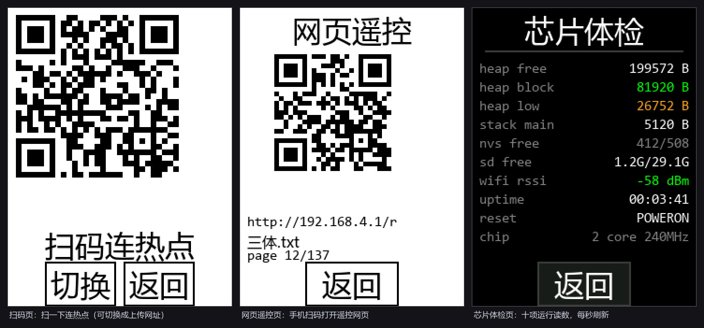
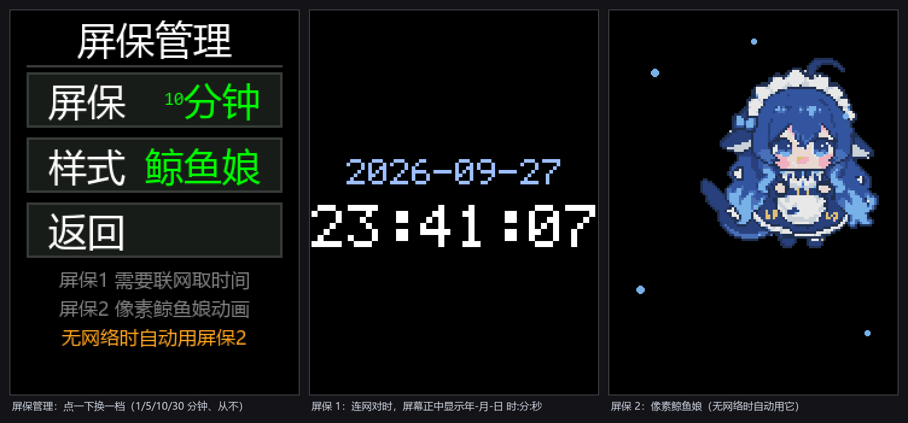

[English](README.md) · **简体中文**

# Ereader · ESP32 黄板多功能手持设备

基于 **ESP32-2432S028R（Cheap Yellow Display / CYD）** 的固件：看 TXT 小说与 **EPUB**、
翻图片、网页传文件、**用手机浏览器遥控阅读**、6 位开机密码、PWM 亮度调节。

界面是一套自研的**行带流式渲染器**：全屏只有一条 240×64 的 DMA 行带，所有界面
都是"逐行合成"再推屏。这块板子没有 PSRAM、可用的最大连续内存只有约 80KB，
而"边解码边推屏"是它显示 1080P 图片的唯一可行路径（见 [实现要点](#实现要点)）。

> **只想烧个成品直接用？** 每个 [Release](../../releases) 都附了固件包 ——
> 不用装工具链、不用改代码。直接看[直接下载成品固件](#直接下载成品固件)。


---

## 功能

| 模块 | 能力 |
|---|---|
| **阅读** | `/sdcard/novels` 下的 `.txt` 与 **`.epub`**。TXT：自动识别 UTF-8 / GBK / GB2312 与 BOM；EPUB：边读边解压，图片一律跳过，只取文字。自动分页、过滤空行；黑底白字；**书签**（存页号，重启后仍可跳回） |
| **图片** | 浏览 `/sdcard/images` 下的 JPEG / BMP；等比适配不拉伸；1080P 可用；**删除**当前图片（带二次确认） |
| **网络** | 连接 WLAN（扫描、密码键盘、状态显示）；**AP 模式**（板子自己开热点，没有路由器也能用）；浏览器上传网页（可选目录 + 文件列表）；**手机网页遥控** —— 手机打开 `http://<板子IP>/r` 就能翻页 / 跳页 / 调亮度；屏幕上还能直接显示**二维码**（连热点、开遥控网页） |
| **设置** | **设备安全**：6 位数字开机密码（开启后每次开机需输入）；**亮度调节**：1%~100% 无级（PWM）；**芯片体检**（空闲堆 / 最大连续块 / 栈 / NVS / SD / 信号 / 开机时长 / 复位原因，每秒刷新）；**RGB 指示灯**（操作时闪一下，可关）；忘记网络 |
| **屏保** | 空闲自动触发：**1 / 5 / 10 / 30 分钟或从不**，两种样式。**时间屏保** —— 触发时连 WiFi 用 SNTP 对时，屏幕正中显示 `年-月-日  时:分:秒`（纯黑底）；**像素鲸鱼娘** —— 120×120 的动画精灵。取不到时间（没存过网络 / 连不上 / 空闲堆不够）会自动**退到鲸鱼娘**。摸一下屏只唤醒、不会触发任何按钮 |
| **文件结构** | 插卡自动创建 `images` / `novels` 目录，空卡也能直接用 |

## 效果图

> 以下界面图按固件里的版面常量渲染，与实体屏上的版式一致
> （字体为系统字体，屏上用的是自带的点阵字库）。

### 阅读


### 图片


### 网络


### 设置


### 手机遥控



### 屏保



---

## 硬件

| 项 | 值 |
|---|---|
| 开发板 | ESP32-2432S028R（CYD），2.8 寸 240×320 电阻触摸屏 |
| 芯片 | ESP32-D0WD-V3 双核 240MHz |
| Flash | 4MB（单 `factory` 分区，app 约 3.0MB，分区余量约 21%） |
| PSRAM | **无** |
| 存储 | microSD 卡（SPI，可选；没有卡也能开机） |

> ⚠️ **屏幕驱动有两种批次**：单 Micro-USB 口的是 **ILI9341**，双口（Micro-USB + USB-C）
> 的是 **ST7789**。本项目按 **ST7789 + 不反色 + BGR** 配置（`main/drivers/board_pins.h`）。
> 如果你的是 ILI9341 版，需要改这个文件里的面板参数。

### 引脚

| 功能 | 引脚 |
|---|---|
| TFT CS / DC / MOSI / MISO / SCLK / BL | 15 / 2 / 13 / 12 / 14 / **21** |
| 触摸 XPT2046 CS / MOSI / MISO / CLK / IRQ | 33 / 32 / 39 / 25 / 36 |
| SD 卡 CS / MOSI / MISO / SCLK | 5 / 23 / 19 / 18 |
| 板载 RGB LED | R=4 G=16 B=17 |

---

## 编译与烧录

### 直接下载成品固件

**不用编译、不用改代码。**每个 [Release](../../releases) 都附了一个 `ereader-fw-<版本>.zip`，**开箱即用**：
不需要装 ESP-IDF、不需要编译工具链、**一行代码都不用改**。包里是完整的烧录镜像、
四个单独的分区文件、一键烧录脚本，以及一份中英双语的 `FLASH.txt`（内容与本节相同）。

**需要准备什么**

| | |
|---|---|
| 开发板 | ESP32-2432S028R（CYD）。本发布版针对 **ST7789** 屏（双 USB 口那批）—— 见[硬件](#硬件)下的提醒 |
| 一根 USB **数据线** | 只能充电的线不行 |
| CH340 驱动 | 仅 Windows 需要；Linux / macOS 一般已自带 |
| esptool | `pip install esptool`（需要 Python 3） |
| 一张 microSD 卡 | 可选，但几乎所有功能都要用 —— 格式化成 FAT32 |

**步骤**

1. **下载并解压** Releases 页面上的 `ereader-fw-<版本>.zip`：

   ```
   ereader-fw-<版本>/
   ├── ereader-full.bin       完整镜像   → 烧 0x0
   ├── ereader.bin            仅应用     → 烧 0x20000
   ├── bootloader.bin         → 0x1000
   ├── partition-table.bin    → 0x8000
   ├── ota_data_initial.bin   → 0xe000
   ├── flash.bat / flash.sh   一键烧录脚本
   ├── SHA256SUMS.txt         校验和
   └── FLASH.txt              中英双语说明
   ```

2. **用数据线把板子插上电脑**，找到它的串口：
   - Windows —— 设备管理器 → *端口 (COM 和 LPT)*，例如 `COM3`
   - Linux —— `/dev/ttyUSB0`（或 `/dev/ttyACM0`）
   - macOS —— `/dev/tty.usbserial-*`

3. **烧录。**一条命令，不用改任何东西：

   ```bat
   :: Windows
   flash.bat COM3
   ```

   ```bash
   # Linux / macOS
   ./flash.sh /dev/ttyUSB0
   ```

   或者手工执行：

   ```bash
   esptool.py --chip esp32 --port COM3 --baud 460800 \
     --before default_reset --after hard_reset write_flash \
     --flash_mode dio --flash_size 4MB --flash_freq 40m \
     0x0 ereader-full.bin
   ```

   烧完板子会自己复位并直接进主菜单 —— **不需要按任何按键**，也不用手工进下载模式。

   > ⚠️ `ereader-full.bin` 从 `0x0` 起址、空白用 `0xFF` 填充，所以烧它会一并覆盖
   > `0x9000` 的 NVS 分区 —— 也就是已保存的 WiFi 凭据、开机密码、阅读书签。
   > 首次安装这正是想要的效果。如果是**升级**、想保住已有设置，只烧
   > `ereader.bin` 到 `0x20000` 即可（本工程各版本之间 bootloader 与分区表没有变化）：
   >
   > ```bash
   > esptool.py --chip esp32 --port COM3 --baud 460800 \
   >   --before default_reset --after hard_reset write_flash \
   >   --flash_mode dio --flash_size 4MB --flash_freq 40m \
   >   0x20000 ereader.bin
   > ```

4. **（可选）校验下载是否完整**，对照包里的 `SHA256SUMS.txt`：

   ```bash
   sha256sum -c SHA256SUMS.txt                    # Linux / macOS
   certutil -hashfile ereader-full.bin SHA256     # Windows
   ```

5. **插一张 FAT32 格式的 microSD 卡。**开机时固件会自己创建 `/sdcard/images` 和
   `/sdcard/novels`，所以空卡直接用就行。图片和 txt / epub 可以拷进去，也可以用板子自己的
   上传网页 —— 见[传文件](#2-传文件)。

6. **从主菜单开始用**：阅读 / 图片 / 网络 / 设置。不需要预先建目录，也不需要写任何配置文件。

**遇到问题**

| 现象 | 怎么办 |
|---|---|
| 提示 `No serial data received` | 直接重跑一遍命令。这块板的 USB 串口芯片偶尔会漏掉第一次复位，不用拔插、不用动接线。 |
| 端口列表里找不到板子 | Windows 上先装 CH340 驱动；再确认线是数据线而不是纯充电线。 |
| 屏幕一直是白的 | 大概率是屏幕批次不同 —— 本发布版按 ST7789（双 USB 口）编译。见[硬件](#硬件)下的提醒；ILI9341 的板子需要改代码。 |
| 颜色不对（蓝天发橙） | 同样是面板批次差异。参数在 `main/drivers/board_pins.h`，这种情况需要重新编译。 |

### 从源码编译

#### 环境

- **ESP-IDF v5.5**（其他 5.x 一般也可以）
- Python 3.8+
- 首次编译**需要联网**：组件管理器要拉一个依赖 —— `bitbank2/jpegdec ^1.6.2`
  （JPEG 解码，见 `main/idf_component.yml`）

#### 步骤

```bash
# 0) 装好 ESP-IDF 后激活环境
. $IDF_PATH/export.sh

# 1) 目标芯片（sdkconfig.defaults 里已固定为 esp32，这一步通常可省）
idf.py set-target esp32

# 2) 编译
idf.py build

# 3) 烧录并看串口日志（Windows 下把 COM9 换成你的串口）
idf.py -p COM9 flash monitor
```

产物在 `build/ereader.bin`，可以直接把它烧到 `0x20000`（分区表见下）。

#### 手工烧录（不想用 idf.py 时）

```bash
esptool.py --chip esp32 --port COM9 --baud 460800 \
  --before default_reset --after hard_reset write_flash \
  --flash_mode dio --flash_size 4MB --flash_freq 40m \
  0x1000  build/bootloader/bootloader.bin \
  0x8000  build/partition_table/partition-table.bin \
  0xe000  build/ota_data_initial.bin \
  0x20000 build/ereader.bin
```

#### 分区表

| 名称 | 类型 | 偏移 | 大小 |
|---|---|---|---|
| nvs | data/nvs | 0x9000 | 20KB |
| otadata | data/ota | 0xE000 | 8KB |
| phy_init | data/phy | 0x10000 | 4KB |
| **factory** | app | **0x20000** | 3.81MB |

---

## 使用

### 1. 准备 SD 卡

格式化成 **FAT32**，插进板子即可。开机时固件会自动建好这两个目录：

```
/sdcard/images    ← 放图片（jpg / jpeg / bmp，不递归子目录）
/sdcard/novels    ← 放小说（txt / epub）
```

### 2. 传文件

有两种方式，按手头有没有路由器选：

**有路由器**：`网络 → WLAN` 连上热点，记下屏幕上的 IP；同一网络下用电脑/手机浏览器
打开这个 IP。

**没有路由器**：`网络 → AP模式`，板子自己开一个热点（屏幕会同时显示
热点名、密码和地址，默认密码 `12345678`），手机连上后浏览器打开 `192.168.4.1`。

两种情况都会看到同一个上传页面：选目录、选文件、上传。**图片会在浏览器端先转成
基线 JPEG 并缩到屏幕的 2 倍尺寸再传** —— 手机原图直接传会被解码器降成 1/8 分辨率
（板子只有解码器、没有编码器，这一步只能在浏览器里做）。

### 3. 开机密码

`设置 → 设备安全 → 开启密码`，输入两遍 6 位数字。开启后每次开机都会先弹锁屏键盘。
关闭密码不需要再验证（能进设置页说明已经过了一道）。

---

## 目录结构

```
.
├── CMakeLists.txt              顶层工程定义（目标芯片 esp32）
├── partitions.csv              分区表（单 factory 区，app @ 0x20000）
├── sdkconfig.defaults          默认配置（Flash/FreeRTOS/FATFS 等）
├── screenshots/                README 用的界面图
└── main/
    ├── main.c                  启动入口 + 界面外壳（主菜单 → 分发 → 回主菜单）
    ├── drivers/                显示 / 触摸 / SD 卡 / 板级定义
    ├── nui/                    界面外壳：主菜单、设置、设备安全、芯片体检、指示灯、屏保与精灵、二维码编码器、公共绘制层与字库
    ├── picview/                图片查看器（解码 + 行带显示层 + 触摸 + 扫描）
    ├── reader/                 阅读功能（TXT / EPUB 分页、16px 字库、按钮条、书签）
    ├── net/                    网络（WiFi、HTTP 上传、AP 模式、手机遥控、扫码页、各页面）
    └── book/                   GBK 码表与文件名编码转换
```

---

## 实现要点

以下是几条决定性的设计约束：

**行带流式渲染**
全模块只有一条 240×64 的 DMA 行带（30,720 字节）。所有界面都是"逐行合成"——
从上到下扫一遍屏幕，每一行把落在该行的所有形状依次叠上去。**行带只向前滚，
所以绘制必须按 y 递增**；反过来画的部分会被静默丢弃。

**颜色链路是三个独立环节**
字节序（每像素两字节对调）、BGR 元素顺序、面板反色，各自独立、症状不同，
而且**只有实体屏能验证**（抓屏抓的是对调前的缓冲）。本项目的定案是
`swap=0 / mirror_x=1 / BGR=1 / invert=0`，字节对调发生在 `pv_disp.c::flush_band()`
这唯一一处。

**两级点阵字库**
正文用 16px：主库 4bpp（ASCII + GB2312 + 符号），扩展库 2bpp（GBK 扩展区）。
两级位深不同，所以渲染时必须用字形结构体里的 `row_bytes/bpp`，不能用全局常量。
界面另有一套 32px 字库（只有界面真正用到的那些字）。

**图片重采样用面积平均**
源尺寸和目标尺寸一般不是整数倍，最近邻会丢掉约 26% 的行列并留下锯齿。
这里把映射到同一个目标像素的源像素求平均，等价于一次盒式滤波。

**触摸判据用压力值，不是坐标范围**
XPT2046 悬空时 X/Y 会读到 808/1812 这类值，**恰好落在标定范围之内**，
所以"范围检查"挡不住。这里用 Z 压力值 + 双门限迟滞判按压，
并且**确认按下之后再等两拍**才建立坐标（手指刚接触那几拍的坐标不可信）。

**名字/路径缓冲按 FATFS 上限定**
FATFS 文件名上限 255 字节。早先用 64 字节定长缓冲存文件名，遇到更长的名字
会被 `strncpy` **静默截断**，产出一个磁盘上不存在的"幽灵名字" ——
症状是列表里看得见、点开打不开、删除也删不掉。现在改用名字池 + 明确拒绝
（装不下就跳过并告警），路径拼装也做了截断检测。

**行带缓冲兼职 32KB 临时缓冲**
解一本 EPUB 需要一块 32KB **连续**的 LZ 字典。而 WiFi 一启动就要吃掉约 50~63KB 堆，
手机遥控又**必须**开着 WiFi —— 在这块板子上"字典"和"联网"原本凑不到一起。
解法是分时共用：行带是全工程唯一一块大 DMA 缓冲，而解压一章期间它整块是闲的
（解压过程一屏都不刷），于是把它分配得比行带自身需要的略大
（`pv_config.h: PV_BAND_MIN_ALLOC`），由 `pv_disp_scratch()` 在**一次解压调用**期间
借给字典用。借出去的时候绝不做任何绘制。

**网页发来的命令全部走一条队列**
HTTP 服务跑在自己的任务里，它**从不直接碰界面状态** —— 手机点一下翻页，命令进
FreeRTOS 队列，由界面任务执行（页表与行带都归它管）。这条队列同时充当"要打开哪本书"
这条路径的内存屏障（先写路径、再投消息）。队列必须在 HTTP 服务**可能收到请求之前**
就建好，否则命令会被静默丢掉。

---

## 已知限制

- **渐进式 JPEG 只能解出约 1/8 分辨率的预览**（解码库的行为，不是配置问题）。
  要清晰就用画图工具把图片另存为**基线（baseline）** JPEG。
- 无 PSRAM，可用最大连续内存约 80KB，图片尺寸/数量很大时可能失败。
- **EPUB 受内存限制**：打开一本需要一块 32KB 连续内存加几张较小的表；WiFi 开着时余量
  只有几 KB，所以特别大的 EPUB 可能打不开（屏上会出现「打开失败」）。章节/条目表是
  定长上限：内容文档超过 128 个的 EPUB 只会保留前面那些。
- 电阻屏是单点触摸，**只支持点按**：没有滑动、长按、双指。
- 触摸与面板参数是按本板实测定的；换板/换屏可能需要重新标定，面板参数见
  `main/drivers/board_pins.h`（也可用 NVS `panelcfg` 覆盖，见 `lcd_cfg_load()`）。

---

## 许可

本项目采用 **PolyForm Noncommercial License 1.0.0**（全文见 [LICENSE](LICENSE)）。

| | |
|---|---|
| ✅ 允许 | 个人学习、研究、实验、业余项目、私人娱乐等**非商业目的**的使用、修改与分发 |
| ✅ 允许 | 慈善机构、教育机构、公共研究机构、公共安全/卫生机构、环保组织、政府机构使用 |
| ❌ 不允许 | 任何**商业用途**（含公司内部商业项目）—— 商用须事先取得作者书面授权 |

本期软件与许可者信息：

```
Licensor:        AKHYui
Software:        Ereader-Cheap-Yellow-Display
Required Notice: Copyright 2026 AKHYui
```

> ⚠️ 需要说明的是：**禁止商用本身不符合开源（Open Source）的定义**，
> 所以这是一份 **source-available（源码可见）** 授权，而不是 OSI 认可的开源许可证。
> 它适合"代码公开给人看、给人学，但不想被拿去卖"的场景。如需商用请开 Issue 联系。

### 第三方依赖

以下依赖在**编译时**由 ESP-IDF 组件管理器下载，**不包含在本仓库内**，
遵循其原始许可，不受本项目许可影响：

| 依赖 | 用途 | 许可 |
|---|---|---|
| `bitbank2/jpegdec` | JPEG 解码（含 1/2、1/4、1/8 硬件降采样） | Apache-2.0 |

### 关于字库

仓库里的点阵字库（`main/reader/rd_font16*.bin`、`main/nui/nui_glyphs.c`、
`main/nui/nui_ascii.c`）是**由 Windows 系统字体渲染生成的位图数据**，
不是字体文件本身。个人使用无碍；**若要用于商业场景，请自行确认相应字体的授权条款。**

## 致谢

本代码由作者与DeepSeek-V4.1-Flash协作完成。
